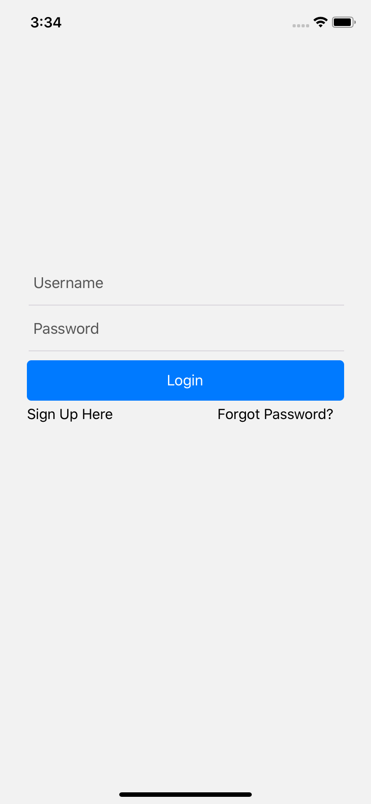
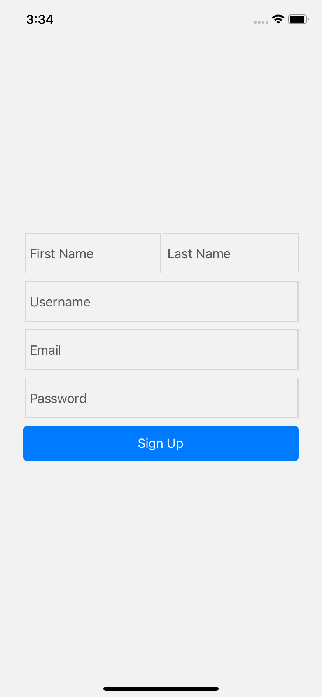
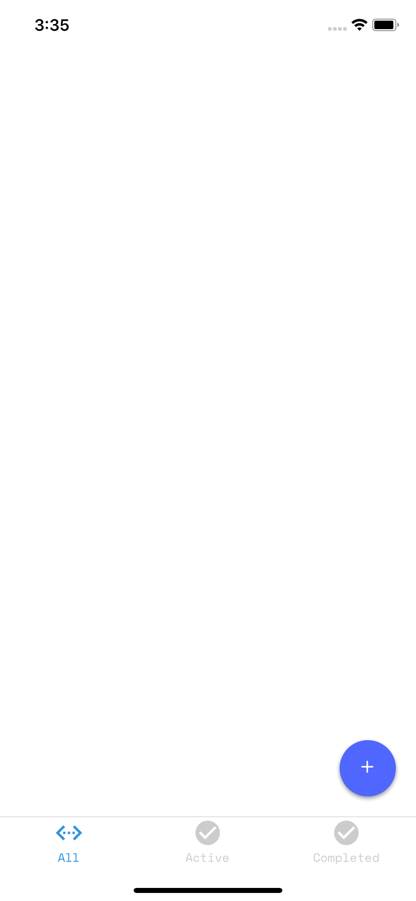
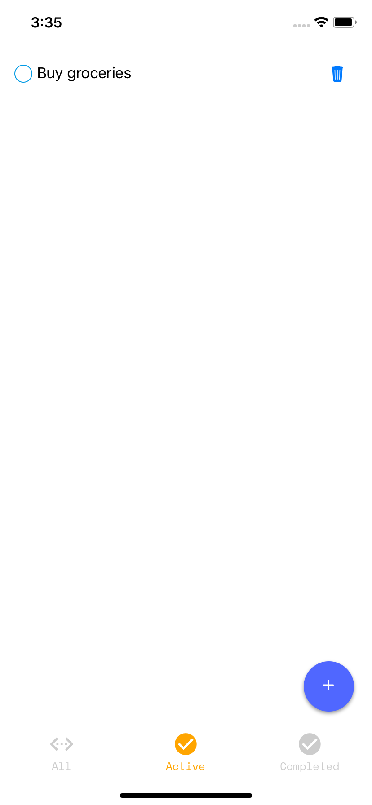
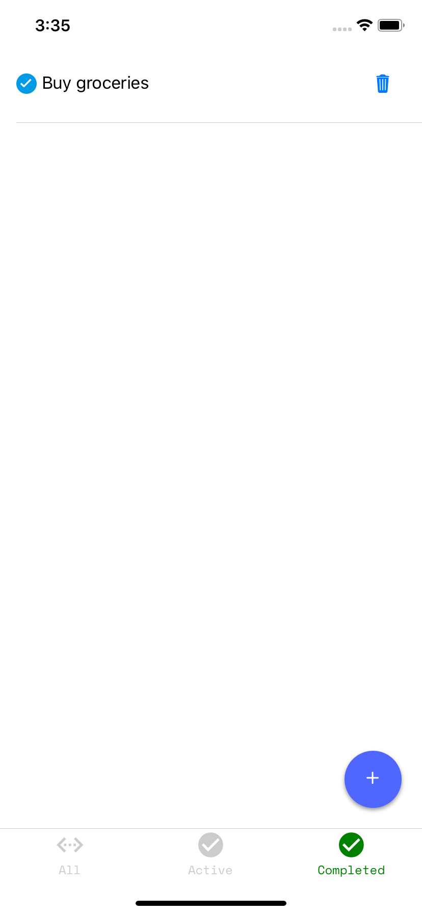

# React Native To-Do App

This app was built using [Expo](https://expo.io) with a few of 3rd party libraries.

## Install

1.  `https://github.com/irfanrosly/rn-todo`
2.  `npm install` or `yarn install`
3.  Run `expo start`

## Demo

## Built With

- [Native Base](https://nativebase.io/) - Essential cross-platform UI components for React Native
- [Reduxsauce](https://github.com/infinitered/reduxsauce) - Some aesthetic toppings for your Redux meal

## Known issues

- Navigation - Cannot perform login due to new navigation structure which I am not so familiar with it.

- Data Nor Persistant - I am not implementing persistent because usually most of data depends on the API call.
